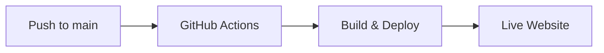

# 🚀 Quick Deployment Guide

This guide provides simple, step-by-step instructions to deploy the Valentine website to GitHub Pages.

## ✨ What You Get

Your website will be automatically deployed to:
```
https://boyeshi.github.io/Valentine/
```

## 🎯 Quick Start (3 Steps)

### Option 1: Using the Deployment Script (Recommended)

```bash
# Run the deployment script
./deploy.sh
```

This script will:
- ✓ Check your repository status
- ✓ Test the website locally
- ✓ Push changes to GitHub
- ✓ Trigger automatic deployment

### Option 2: Manual Deployment

```bash
# 1. Commit your changes
git add .
git commit -m "Update website"

# 2. Push to main branch
git push origin main

# 3. Deployment happens automatically!
```

### Option 3: Manual Workflow Trigger

If you want to deploy without new commits:

1. Go to [Actions tab](https://github.com/Boyeshi/Valentine/actions)
2. Click "Deploy to GitHub Pages" workflow
3. Click "Run workflow" button
4. Select branch (usually `main`)
5. Click "Run workflow"

## 🔍 Verify Deployment

Check if your website is deployed:

```bash
# Run verification script
./verify-deployment.sh
```

Or manually check:
- **Actions Status**: https://github.com/Boyeshi/Valentine/actions
- **Live Website**: https://boyeshi.github.io/Valentine/

## 📋 One-Time Setup

If this is your first deployment, ensure GitHub Pages is enabled:

1. Go to repository [Settings](https://github.com/Boyeshi/Valentine/settings)
2. Click "Pages" in the left sidebar
3. Under "Source", select **GitHub Actions**
4. Save changes

That's it! Your deployment is now configured.

## 🔧 How It Works



1. You push changes to the `main` branch
2. GitHub Actions automatically runs the deployment workflow
3. Your website is built and deployed to GitHub Pages
4. Website is live at https://boyeshi.github.io/Valentine/

## 🧪 Test Locally Before Deploying

```bash
# Start local server
python3 -m http.server 8000

# Open in browser
# http://localhost:8000
```

## 📊 Monitor Deployment

- **Check workflow runs**: Click the "Actions" tab
- **View deployment history**: Check recent workflow runs
- **Green checkmark** ✓ = Successfully deployed
- **Red X** ✗ = Deployment failed (check logs)

## ⚡ Deployment Time

- **Workflow duration**: ~30 seconds
- **DNS propagation**: ~2-5 minutes (first time only)
- **Cache updates**: May take a few minutes to reflect

## 🐛 Troubleshooting

### Website Not Loading?

1. **Check GitHub Pages is enabled**
   - Go to Settings → Pages
   - Source should be "GitHub Actions"

2. **Check workflow status**
   - Go to Actions tab
   - Look for green checkmark ✓
   - If red ✗, click to see error logs

3. **Clear browser cache**
   - Hard refresh: Ctrl+Shift+R (Windows/Linux) or Cmd+Shift+R (Mac)

4. **Wait a few minutes**
   - First deployment may take 5-10 minutes

### Changes Not Showing?

- Ensure you pushed to `main` branch
- Check if workflow ran successfully in Actions tab
- Clear browser cache
- Wait 2-3 minutes for CDN update

### "Resource not accessible by integration" Error?

- Make sure GitHub Pages is enabled with "GitHub Actions" as source
- Check workflow has proper permissions (already configured)

## 📝 Deployment Checklist

- [ ] Make your changes locally
- [ ] Test locally: `python3 -m http.server 8000`
- [ ] Commit changes: `git commit -m "Your message"`
- [ ] Push to main: `git push origin main`
- [ ] Monitor in Actions tab
- [ ] Verify at https://boyeshi.github.io/Valentine/
- [ ] Celebrate! 🎉

## 🔗 Useful Links

- **Live Website**: https://boyeshi.github.io/Valentine/
- **Repository**: https://github.com/Boyeshi/Valentine
- **Actions (Deployment Status)**: https://github.com/Boyeshi/Valentine/actions
- **Settings**: https://github.com/Boyeshi/Valentine/settings/pages

## 💡 Pro Tips

1. **Always test locally first** before deploying
2. **Use meaningful commit messages** to track changes
3. **Monitor the Actions tab** to ensure successful deployment
4. **Deployment is automatic** - just push to main!
5. **The workflow runs on every push** to main branch

## 🎀 Need Help?

- Check the [DEPLOYMENT.md](DEPLOYMENT.md) for detailed instructions
- Review [GitHub Pages documentation](https://docs.github.com/en/pages)
- Check workflow logs in the Actions tab

---

**Happy Deploying! 💕**
